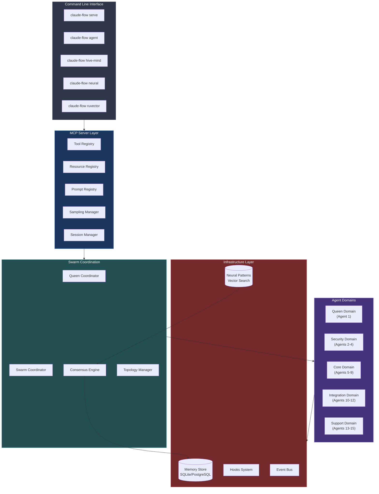
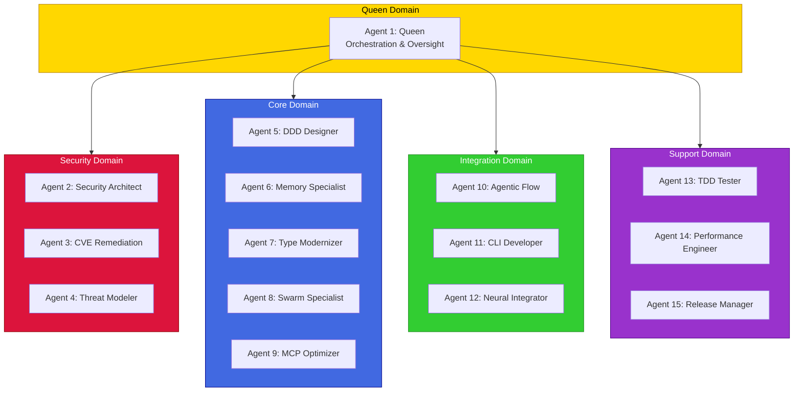
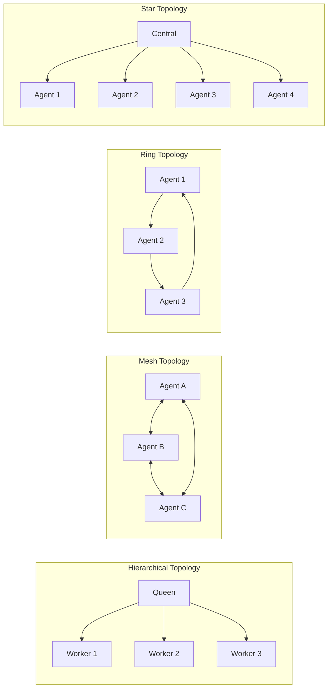

# Claude Flow Go

<div align="center">

**Enterprise-grade Multi-Agent AI Orchestration Framework in Go**

[](https://go.dev)
[](LICENSE)
[](https://modelcontextprotocol.io)

*High-performance Go implementation of Claude Flow v3 for coordinating AI agent swarms with distributed consensus, neural learning, and production-ready infrastructure.*

</div>

---

## What is Claude Flow Go?

Claude Flow Go is a **production-ready framework** for orchestrating multiple AI agents working together on complex tasks. Think of it as a conductor for an orchestra of AI specialists — each agent has unique expertise, and the framework coordinates their collaboration.

### The Problem It Solves

Instead of relying on a single AI to do everything, Claude Flow Go lets you:

- **Spawn specialized agents** (coders, testers, reviewers, security experts)
- **Coordinate their work** through intelligent task routing
- **Learn from outcomes** to improve future performance
- **Scale horizontally** with distributed consensus algorithms
- **Persist knowledge** in vector-enabled memory stores

---

## Architecture Overview



---

## Key Features

### 15-Agent Domain Architecture

The framework organizes agents into specialized domains for optimal task delegation:



### Distributed Consensus Algorithms

Choose the right consensus mechanism for your use case:

| Algorithm | Use Case | Fault Tolerance |
|-----------|----------|-----------------|
| **Raft** | Strong consistency, leader election | N/2 - 1 failures |
| **Byzantine (PBFT)** | Hostile environments | N/3 - 1 failures |
| **Gossip** | Large-scale, eventually consistent | Highly resilient |
| **CRDT** | Conflict-free concurrent updates | Partition tolerant |
| **Quorum** | Simple majority voting | N/2 - 1 failures |

### Swarm Topologies



---

## Quick Start

### Installation

```bash
# Install from source
go install github.com/anthropics/claude-flow-go/cmd/claude-flow@latest

# Or clone and build
git clone https://github.com/anthropics/claude-flow-go.git
cd claude-flow-go
go build -o claude-flow ./cmd/claude-flow
```

### Your First Swarm (5 minutes)

```bash
# 1. Initialize the Hive Mind with 15 agents
claude-flow hive-mind init --algorithm majority --v3

# 2. Check the status
claude-flow hive-mind status --verbose

# 3. Submit a task
claude-flow hive-mind task "Implement user authentication API" --priority high --domain core

# 4. Watch agents collaborate
claude-flow hive-mind status --verbose
```

### Start the MCP Server

```bash
# Start the server for Claude Code integration
claude-flow serve --port 3000 --host localhost

# The server exposes:
# - Tool registry for agent operations
# - Resource caching for efficient access
# - Prompt management
# - Session handling
```

---

## CLI Reference

### Core Commands

```
claude-flow
├── serve           Start the MCP server
├── status          Show system status
├── agent           Agent management
│   ├── spawn       Spawn a new agent
│   └── list        List all agents
├── workflow        Workflow execution
│   └── run         Execute a workflow
├── memory          Memory operations
│   ├── store       Store a memory entry
│   └── query       Query memories
├── hive-mind       Multi-agent coordination
├── neural          Neural pattern learning
├── ruvector        PostgreSQL vector storage
├── hooks           Self-learning hooks
├── doctor          System diagnostics
├── daemon          Background service
└── benchmark       Performance testing
```

---

## Detailed Examples

### Example 1: Spawning Agents

```bash
# Spawn a coder agent
claude-flow agent spawn --id coder-1 --type coder

# Spawn with specific capabilities
claude-flow agent spawn \
  --id security-expert \
  --type security-architect \
  --capabilities "threat-modeling,pen-testing,code-review"

# List all active agents
claude-flow agent list
```

**Output:**
```json
{
  "id": "coder-1",
  "type": "coder",
  "status": "active",
  "capabilities": ["code", "refactor", "debug"],
  "createdAt": "2025-02-03T10:30:00Z"
}
```

### Example 2: Hive Mind Coordination

```bash
# Initialize with Byzantine fault tolerance
claude-flow hive-mind init \
  --algorithm supermajority \
  --quorum 0.67 \
  --v3

# Spawn workers into specific domains
claude-flow hive-mind spawn --count 3 --domain security --type security-architect
claude-flow hive-mind spawn --count 5 --domain core --type coder

# Submit a task requiring consensus
claude-flow hive-mind task "Refactor authentication module" \
  --priority high \
  --domain security \
  --consensus supermajority

# Create a proposal for major changes
claude-flow hive-mind consensus create architectural-change \
  "Migrate from REST to GraphQL" \
  --quorum 0.75 \
  --timeout 60000

# Vote on the proposal
claude-flow hive-mind consensus vote proposal-123 --approve

# Check proposal result
claude-flow hive-mind consensus result proposal-123
```

**Status Output:**
```
=== Hive Mind Status ===
Initialized:      true
Algorithm:        supermajority
Active Proposals: 2
Total Agents:     15
Active Agents:    15
Queen Agent:      queen-1

Active Domains:
  - queen
  - security
  - core
  - integration
  - support

=== Domain Health ===
DOMAIN        TOTAL  ACTIVE  HEALTH  AVG LOAD
queen         1      1       100%    15%
security      3      3       100%    45%
core          5      5       100%    62%
integration   3      3       100%    38%
support       3      3       100%    25%
```

### Example 3: Neural Pattern Learning

```bash
# Train patterns on your codebase
claude-flow neural train \
  --pattern coordination \
  --epochs 100 \
  --data ./training-data.json \
  --learning-rate 0.01

# Learn from successful outcomes
claude-flow neural learn \
  --agent-id coder-1 \
  --type outcome \
  --input "Successfully refactored auth module with 90% test coverage"

# Search for relevant patterns
claude-flow neural patterns --action search --query "authentication best practices"

# Export patterns for sharing
claude-flow neural export --output ./patterns.json --sign

# Import patterns from another team
claude-flow neural import --file ./shared-patterns.json --verify --merge
```

**Training Output:**
```
Training neural patterns (type: coordination, epochs: 100)
--------------------------------------------------
Epoch 100/100 [██████████████████████████████] Loss: 0.0234

--------------------------------------------------
Training Complete!
  Patterns created: 256
  Final loss:       0.0234
  Adaptations:      47
  Training time:    1523ms
```

### Example 4: PostgreSQL Vector Storage (RuVector)

```bash
# Generate setup files
claude-flow ruvector setup --output ./postgres-setup

# Initialize RuVector in PostgreSQL
claude-flow ruvector init \
  --host localhost \
  --port 5432 \
  --database claude_flow \
  --dimensions 1536 \
  --index-type hnsw

# Import existing embeddings from SQLite
claude-flow ruvector import \
  --from-sqlite ./data/memory.db \
  --batch-size 100 \
  --verbose

# Run performance benchmark
claude-flow ruvector benchmark \
  --vectors 10000 \
  --dimensions 1536 \
  --queries 100 \
  --index hnsw

# Optimize indexes
claude-flow ruvector optimize --vacuum --reindex

# Check status
claude-flow ruvector status --verbose
```

**Benchmark Output:**
```
Benchmark Results
--------------------------------------------------
METRIC                    VALUE
Vectors                   10000
Dimensions                1536
Index Type                hnsw
Insert Throughput         8500 vectors/sec
Index Build Time          234 ms
Query Latency (avg)       0.45 μs
Query Latency (p95)       0.89 μs
Query Latency (p99)       1.23 μs
QPS                       125000
Recall Estimate           98%
```

### Example 5: Self-Learning Hooks

```bash
# List all registered hooks
claude-flow hooks list

# Enable pattern learning
claude-flow hooks config set --learning --learning-rate 0.15

# View statistics
claude-flow hooks stats

# Test a hook before deployment
claude-flow hooks test pre-edit \
  --input '{"file": "auth.go", "changes": ["add validation"]}' \
  --verbose \
  --dry-run

# Reset patterns to start fresh
claude-flow hooks reset --patterns --confirm
```

**Hooks Statistics:**
```
Hooks Statistics
==================================================

Execution Summary:
  Total Executions:    1,234
  Successful:          1,189
  Failed:              45
  Avg Execution Time:  2.34 ms

Pattern Learning:
  Total Patterns:      847
  Edit Patterns:       423
  Command Patterns:    424

Routing:
  Total Routings:      2,567
  Success Rate:        94.2%
```

---

## Go API Usage

### Basic Swarm Coordination

```go
package main

import (
    "context"
    "log"

    claudeflow "github.com/anthropics/claude-flow-go/pkg/claude-flow"
)

func main() {
    // Create a swarm coordinator with mesh topology
    coordinator, err := claudeflow.NewSwarmCoordinator(claudeflow.SwarmConfig{
        Topology: claudeflow.TopologyMesh,
    })
    if err != nil {
        log.Fatal(err)
    }
    defer coordinator.Shutdown()

    // Spawn specialized agents
    coder, _ := coordinator.SpawnAgent(claudeflow.AgentConfig{
        ID:           "coder-1",
        Type:         claudeflow.AgentTypeCoder,
        Capabilities: []string{"go", "typescript", "refactoring"},
    })

    reviewer, _ := coordinator.SpawnAgent(claudeflow.AgentConfig{
        ID:           "reviewer-1",
        Type:         claudeflow.AgentTypeReviewer,
        Capabilities: []string{"code-review", "security-audit"},
    })

    // Execute a coding task
    result, err := coordinator.ExecuteTask(coder.ID, claudeflow.Task{
        ID:          "task-1",
        Type:        claudeflow.TaskTypeCode,
        Description: "Implement JWT authentication middleware",
        Priority:    claudeflow.PriorityHigh,
    })
    if err != nil {
        log.Fatal(err)
    }

    log.Printf("Task completed: %s", result.Status)
    log.Printf("Output: %s", result.Output)
}
```

### Workflow Execution

```go
package main

import (
    "context"
    "log"

    claudeflow "github.com/anthropics/claude-flow-go/pkg/claude-flow"
)

func main() {
    coordinator, _ := claudeflow.NewSwarmCoordinator(claudeflow.SwarmConfig{
        Topology: claudeflow.TopologyHierarchical,
    })
    defer coordinator.Shutdown()

    // Create workflow engine
    engine, _ := claudeflow.NewWorkflowEngine(claudeflow.WorkflowEngineConfig{
        Coordinator: coordinator,
    })
    defer engine.Shutdown()

    // Define a multi-step workflow
    workflow := claudeflow.WorkflowDefinition{
        ID:   "feature-development",
        Name: "Full-Stack Feature Development",
        Tasks: []claudeflow.Task{
            {
                ID:          "design",
                Type:        claudeflow.TaskTypeDesign,
                Description: "Design API schema",
                Priority:    claudeflow.PriorityHigh,
            },
            {
                ID:           "implement",
                Type:         claudeflow.TaskTypeCode,
                Description:  "Implement API endpoints",
                Priority:     claudeflow.PriorityHigh,
                Dependencies: []string{"design"},
            },
            {
                ID:           "test",
                Type:         claudeflow.TaskTypeTest,
                Description:  "Write integration tests",
                Priority:     claudeflow.PriorityMedium,
                Dependencies: []string{"implement"},
            },
            {
                ID:           "review",
                Type:         claudeflow.TaskTypeReview,
                Description:  "Security review",
                Priority:     claudeflow.PriorityMedium,
                Dependencies: []string{"implement"},
            },
            {
                ID:           "deploy",
                Type:         claudeflow.TaskTypeDeploy,
                Description:  "Deploy to staging",
                Priority:     claudeflow.PriorityLow,
                Dependencies: []string{"test", "review"},
            },
        },
    }

    // Execute with automatic dependency resolution
    ctx := context.Background()
    result, err := engine.ExecuteWorkflow(ctx, workflow)
    if err != nil {
        log.Fatal(err)
    }

    log.Printf("Workflow completed: %s", result.Status)
    log.Printf("Duration: %dms", result.Duration)
}
```

### Memory and Vector Search

```go
package main

import (
    "log"

    claudeflow "github.com/anthropics/claude-flow-go/pkg/claude-flow"
)

func main() {
    // Create hybrid memory backend (SQLite + Vector)
    backend, err := claudeflow.NewMemoryBackend(claudeflow.MemoryBackendConfig{
        SQLitePath: "./data/memory.db",
        Dimensions: 1536,
        EnableHNSW: true,
    })
    if err != nil {
        log.Fatal(err)
    }

    // Store a memory with embedding
    memory := claudeflow.Memory{
        ID:      "mem-1",
        AgentID: "coder-1",
        Content: "Always use prepared statements to prevent SQL injection",
        Type:    claudeflow.MemoryTypeFact,
        Tags:    []string{"security", "database", "best-practice"},
    }
    
    stored, _ := backend.Store(memory)
    log.Printf("Stored memory: %s", stored.ID)

    // Semantic search
    results, _ := backend.SearchSimilar("how to prevent database attacks", 5)
    for _, r := range results {
        log.Printf("Found: %s (score: %.2f)", r.Content, r.Score)
    }

    // Query with filters
    memories, _ := backend.Query(claudeflow.MemoryQuery{
        AgentID: "coder-1",
        Type:    claudeflow.MemoryTypeFact,
        Tags:    []string{"security"},
        Limit:   10,
    })
    log.Printf("Found %d memories", len(memories))
}
```

### Hive Mind with Consensus

```go
package main

import (
    "context"
    "log"

    claudeflow "github.com/anthropics/claude-flow-go/pkg/claude-flow"
)

func main() {
    // Create hive mind manager
    manager, err := claudeflow.NewHiveMindManager(claudeflow.HiveMindConfig{
        ConsensusAlgorithm: claudeflow.ConsensusTypeSuperMajority,
        VoteTimeout:        30000,
        MaxProposals:       100,
        EnableLearning:     true,
        DefaultQuorum:      0.67,
    })
    if err != nil {
        log.Fatal(err)
    }
    defer manager.Shutdown()

    ctx := context.Background()

    // Initialize with full 15-agent hierarchy
    if err := manager.InitializeV3(ctx); err != nil {
        log.Fatal(err)
    }

    // Create a proposal for architectural change
    proposal := claudeflow.Proposal{
        Type:           "architecture",
        Description:    "Migrate to microservices architecture",
        RequiredType:   claudeflow.ConsensusTypeSuperMajority,
        RequiredQuorum: 0.75,
        Proposer:       "architect-1",
    }

    created, _ := manager.CreateProposal(ctx, proposal)
    log.Printf("Created proposal: %s", created.ID)

    // Collect votes from agents
    result, _ := manager.CollectVotesSync(ctx, created.ID)
    
    log.Printf("Consensus reached: %v", result.ConsensusReached)
    log.Printf("Approval: %.1f%%", result.WeightedApproval*100)
}
```

---

## Project Structure

```
claude-flow-go/
├── cmd/
│   └── claude-flow/
│       ├── main.go              # CLI entry point
│       └── commands/            # CLI command implementations
│           ├── hivemind.go      # Hive Mind commands
│           ├── neural.go        # Neural learning commands
│           ├── ruvector.go      # PostgreSQL vector commands
│           ├── hooks.go         # Self-learning hooks
│           ├── daemon.go        # Background service
│           ├── doctor.go        # System diagnostics
│           └── benchmark.go     # Performance testing
│
├── internal/
│   ├── domain/                  # Domain entities (DDD)
│   │   ├── agent/              # Agent domain model
│   │   ├── claims/             # Task claiming system
│   │   ├── embeddings/         # Vector embeddings
│   │   ├── eventsourcing/      # Event sourcing primitives
│   │   ├── hooks/              # Hooks domain types
│   │   ├── memory/             # Memory domain model
│   │   ├── neural/             # Neural pattern types
│   │   ├── security/           # Security domain
│   │   ├── task/               # Task domain model
│   │   └── transfer/           # Data transfer types
│   │
│   ├── application/             # Application services
│   │   ├── claims/             # Load balancing & work stealing
│   │   ├── consensus/          # Raft, Byzantine, Gossip, CRDT
│   │   ├── coordinator/        # Queen & Swarm coordination
│   │   ├── embeddings/         # Embedding generation
│   │   ├── eventsourcing/      # Event replay & projections
│   │   ├── hivemind/           # Hive Mind management
│   │   ├── hooks/              # Hooks service
│   │   ├── memory/             # Memory operations
│   │   ├── neural/             # Neural learning service
│   │   ├── ruvector/           # PostgreSQL bridge
│   │   ├── security/           # Security validation
│   │   ├── transfer/           # Data publishing
│   │   ├── utility/            # Doctor, Daemon, Benchmark
│   │   └── workflow/           # Workflow execution
│   │
│   ├── infrastructure/          # Infrastructure layer
│   │   ├── attention/          # Flash, Multi-head, MoE attention
│   │   ├── claims/             # Claim persistence
│   │   ├── embeddings/         # OpenAI, Local providers
│   │   ├── events/             # Event bus
│   │   ├── eventsourcing/      # SQLite event store
│   │   ├── federation/         # Distributed coordination
│   │   ├── hooks/              # Hooks persistence & routing
│   │   ├── mcp/                # MCP server implementation
│   │   │   ├── completion/     # Auto-completion
│   │   │   ├── logging/        # Log management
│   │   │   ├── prompts/        # Prompt registry
│   │   │   ├── resources/      # Resource caching
│   │   │   ├── sampling/       # LLM sampling
│   │   │   ├── sessions/       # Session management
│   │   │   ├── tasks/          # Task management
│   │   │   └── tools/          # Tool implementations
│   │   ├── memory/             # SQLite, AgentDB, Hybrid
│   │   ├── messaging/          # Priority queues, deques
│   │   ├── neural/             # RL algorithms, LoRA, EWC
│   │   ├── plugins/            # Plugin system
│   │   ├── pool/               # Connection pooling
│   │   ├── routing/            # Task routing
│   │   ├── ruvector/           # PostgreSQL backend
│   │   ├── security/           # Auth, hashing, validation
│   │   └── topology/           # Mesh, Ring, Star, Hierarchical
│   │
│   └── shared/                  # Shared types and utilities
│
└── pkg/
    └── claude-flow/             # Public API
        └── claude-flow.go       # High-level interface
```

---

## Memory Backends

### SQLite (Default)

Fast, embedded storage for single-node deployments:

```bash
claude-flow memory store \
  --agent-id coder-1 \
  --content "Use context.Context for cancellation" \
  --type fact
```

### PostgreSQL + pgvector (RuVector)

Enterprise-grade vector storage for production:

```bash
# Initialize PostgreSQL backend
claude-flow ruvector init \
  --database claude_flow \
  --dimensions 1536 \
  --index-type hnsw

# Migrate from SQLite
claude-flow ruvector import --from-sqlite ./data/memory.db
```

### Hybrid Mode

Combine both for optimal performance:

```go
backend, _ := claudeflow.NewMemoryBackend(claudeflow.MemoryBackendConfig{
    SQLitePath:     "./data/local.db",      // Fast local cache
    PostgresConfig: postgresConfig,          // Distributed storage
    Mode:           claudeflow.HybridMode,
})
```

---

## MCP Integration

Claude Flow Go implements the **MCP 2025-11-25** specification for seamless Claude Code integration.

### Capabilities

| Capability | Description |
|------------|-------------|
| **Tools** | 20+ tools for agent, memory, task, and session operations |
| **Resources** | Cached resource access with configurable TTL |
| **Prompts** | Dynamic prompt templates with argument interpolation |
| **Sampling** | LLM provider abstraction with automatic failover |
| **Logging** | Structured logging with configurable levels |
| **Sessions** | Persistent session management with context preservation |

### Adding to Claude Code

```bash
# Register the MCP server
claude mcp add claude-flow-go -- claude-flow serve --port 3000

# Verify registration
claude mcp list
```

---

## Performance

### Benchmarks (M1 MacBook Pro)

| Operation | Throughput | Latency |
|-----------|------------|---------|
| Agent Spawn | 5,000/sec | 0.2ms |
| Memory Store | 10,000/sec | 0.1ms |
| Vector Search (10k vectors) | 50,000 QPS | 0.02ms |
| Pattern Match | 100,000/sec | 0.01ms |
| Consensus Round | 1,000/sec | 1ms |

### Run Your Own Benchmarks

```bash
# System benchmark
claude-flow benchmark

# Neural performance
claude-flow neural benchmark --dim 256 --iterations 10000

# Vector search benchmark
claude-flow ruvector benchmark --vectors 100000 --queries 1000
```

---

## Development

### Prerequisites

- Go 1.22+
- SQLite (embedded, no setup required)
- PostgreSQL 14+ with pgvector (optional, for RuVector)

### Build

```bash
# Build
go build ./...

# Run tests
go test ./...

# Run with race detector
go test -race ./...

# Run linter
golangci-lint run

# Build for multiple platforms
GOOS=linux GOARCH=amd64 go build -o claude-flow-linux ./cmd/claude-flow
GOOS=darwin GOARCH=arm64 go build -o claude-flow-mac ./cmd/claude-flow
```

### System Diagnostics

```bash
# Run the doctor command
claude-flow doctor

# Check specific components
claude-flow doctor --check memory
claude-flow doctor --check neural
claude-flow doctor --check consensus
```

---

## Contributing

1. Fork the repository
2. Create a feature branch (`git checkout -b feature/amazing`)
3. Write tests for your changes
4. Run the test suite (`go test ./...`)
5. Commit your changes (`git commit -m 'Add amazing feature'`)
6. Push to the branch (`git push origin feature/amazing`)
7. Open a Pull Request

---

## License

MIT License - see [LICENSE](LICENSE) for details.

---

<div align="center">

**[Documentation](https://github.com/anthropics/claude-flow-go/wiki)** · 
**[Examples](./examples)** · 
**[Issues](https://github.com/anthropics/claude-flow-go/issues)** · 
**[Discussions](https://github.com/anthropics/claude-flow-go/discussions)**

*Built with Go for performance, designed for AI collaboration*

</div>
