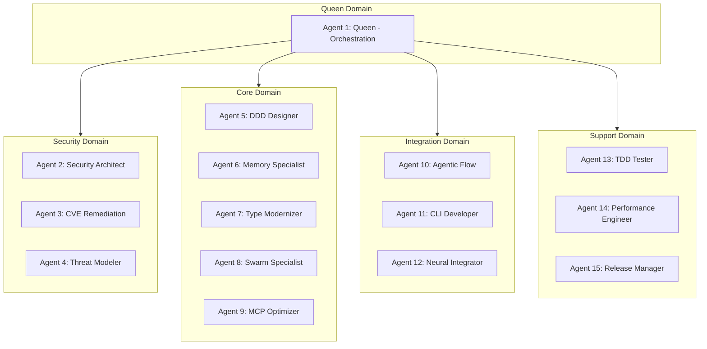
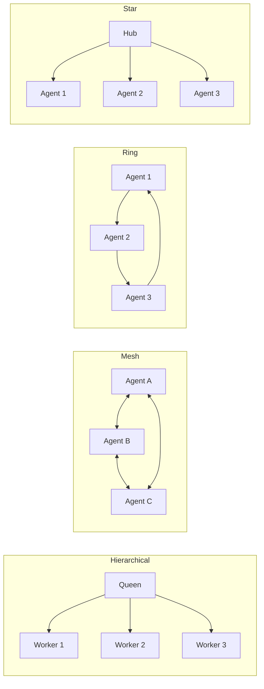

# Claude Flow Go

<div align="center">

**Enterprise-grade Multi-Agent AI Orchestration Framework in Go**

[](https://go.dev)
[](LICENSE)
[](https://modelcontextprotocol.io)

*High-performance Go implementation of Claude Flow v3 for coordinating AI agent swarms with distributed consensus, neural learning, and production-ready infrastructure.*

</div>

---

## What is Claude Flow Go?

Claude Flow Go is a **production-ready framework** for orchestrating multiple AI agents working together on complex tasks. Think of it as a conductor for an orchestra of AI specialists — each agent has unique expertise, and the framework coordinates their collaboration.

### The Problem It Solves

Instead of relying on a single AI to do everything, Claude Flow Go lets you:

- **Spawn specialized agents** (coders, testers, reviewers, security experts)
- **Coordinate their work** through intelligent task routing
- **Learn from outcomes** to improve future performance
- **Scale horizontally** with distributed consensus algorithms
- **Persist knowledge** in vector-enabled memory stores

---

## Quick Start

### Installation

```bash
# Clone the repository
git clone https://github.com/anthropics/claude-flow-go.git
cd claude-flow-go

# Build the binary
go build -o claude-flow ./cmd/claude-flow

# (Optional) Install globally
go install ./cmd/claude-flow

# Or move to a directory in your PATH
sudo mv claude-flow /usr/local/bin/
```

**Verify installation:**

```bash
claude-flow --version
# Output: claude-flow version 3.0.0-alpha.1
```

### Your First Swarm (5 minutes)

```bash
# 1. Initialize the Hive Mind with 15 agents
claude-flow hive-mind init --algorithm majority --v3

# 2. Check the status
claude-flow hive-mind status --verbose

# 3. Submit a task
claude-flow hive-mind task "Implement user authentication API" --priority high --domain core

# 4. Watch agents collaborate
claude-flow hive-mind status --verbose
```

---

## Claude Code Integration

Claude Flow Go implements the **MCP 2025-11-25** specification for seamless integration with Claude Code. It exposes 50+ tools for agent coordination, memory management, neural learning, and more.

### Prerequisites

Before configuring Claude Code, ensure `claude-flow` is accessible:

```bash
# Option A: Install globally (recommended)
cd /path/to/claude-flow-go
go install ./cmd/claude-flow

# Option B: Build and add to PATH
go build -o claude-flow ./cmd/claude-flow
sudo mv claude-flow /usr/local/bin/

# Verify it works
claude-flow --version
```

### Configuration

Add Claude Flow Go to your Claude Code MCP configuration file (`~/.claude/claude_desktop_config.json` or your IDE's MCP settings):

**Option 1: Using Global Installation**

```json
{
  "mcpServers": {
    "claude-flow": {
      "command": "claude-flow",
      "args": ["serve"]
    }
  }
}
```

**Option 2: Using Absolute Path**

```json
{
  "mcpServers": {
    "claude-flow": {
      "command": "/path/to/claude-flow-go/claude-flow",
      "args": ["serve"]
    }
  }
}
```

**Option 3: With Custom Port**

```json
{
  "mcpServers": {
    "claude-flow": {
      "command": "claude-flow",
      "args": ["serve", "--host", "localhost", "--port", "3000"]
    }
  }
}
```

### Starting the MCP Server Manually

```bash
# Start the server
claude-flow serve --port 3000 --host localhost

# The server exposes:
# - Tool registry for agent operations
# - Resource caching for efficient access
# - Prompt management
# - Session handling
```

### Available MCP Tools

Once integrated, Claude Code gains access to these tool categories:

| Category | Tools | Description |
|----------|-------|-------------|
| **Agent** | `agent_spawn`, `agent_list`, `agent_terminate`, `agent_metrics`, `agent_types_list`, `agent_pool_scale`, `agent_health` | Spawn and manage AI agents |
| **Memory** | `memory_store`, `memory_retrieve`, `memory_query`, `memory_search`, `memory_delete`, `memory_drift`, `memory_optimize`, `memory_sync`, `memory_stats` | Persistent knowledge storage with vector search |
| **Tasks** | `tasks/create`, `tasks/list`, `tasks/status`, `tasks/cancel`, `tasks/assign`, `tasks/update`, `tasks/dependencies`, `tasks/results` | Task lifecycle management |
| **Hooks** | `hooks/pre-edit`, `hooks/post-edit`, `hooks/pre-command`, `hooks/post-command`, `hooks/route`, `hooks/explain`, `hooks/pretrain`, `hooks/metrics` | Self-learning hooks for intelligent routing |
| **Reasoning** | `reasoning_store`, `reasoning_retrieve`, `reasoning_learn`, `reasoning_optimize` | Pattern-based reasoning |
| **SONA** | `sona_mode`, `sona_adapt`, `sona_metrics`, `sona_optimize` | Self-Organizing Neural Adaptation |
| **Review** | `review_request`, `review_verdict`, `review_challenge`, `review_status`, `review_divergent` | Adversarial review system |
| **Workers** | `worker_dispatch`, `worker_status`, `worker_cancel`, `worker_triggers`, `worker_results`, `worker_stats`, `worker_pool`, `worker_health` | Background worker management |
| **Federation** | `federation/status`, `federation/spawn-ephemeral`, `federation/register-swarm`, `federation/broadcast`, `federation/propose`, `federation/vote` | Cross-swarm coordination |
| **Sessions** | `session/save`, `session/restore`, `session/list`, `session/close`, `session/info` | Session state persistence |
| **Config** | `config_get`, `config_set`, `config_list`, `config_validate`, `swarm_state`, `swarm_reconfigure` | Runtime configuration |

---

## Key Features

### 15-Agent Domain Architecture

The framework organizes agents into specialized domains for optimal task delegation:



### Distributed Consensus Algorithms

Choose the right consensus mechanism for your use case:

| Algorithm | Use Case | Fault Tolerance | Latency |
|-----------|----------|-----------------|---------|
| **Raft** | Strong consistency, leader election | f failures with 2f+1 nodes | <100ms |
| **Byzantine (PBFT)** | Hostile environments, untrusted nodes | f Byzantine failures with 3f+1 nodes | <200ms |
| **Gossip** | Large-scale (100+ nodes), eventual consistency | Partition tolerant | <500ms |

### Swarm Topologies



| Topology | Best For | Max Agents | Latency |
|----------|----------|------------|---------|
| **Mesh** | Resilient communication, peer-to-peer | 100 | 15-35ms |
| **Hierarchical** | Clear command structure, queen-worker pattern | Unlimited | 10-25ms |
| **Ring** | Sequential processing pipelines | 50 | 15-35ms |
| **Star** | Simple coordination, central hub | 50 | 10-20ms |
| **Hybrid** | Enterprise deployments, mesh + hierarchical | 200 | 20-50ms |

### Neural Learning

The framework includes advanced neural learning capabilities:

- **LoRA Adaptation**: Efficient fine-tuning with Low-Rank Adaptation for per-agent customization
- **EWC (Elastic Weight Consolidation)**: Prevents catastrophic forgetting during continual learning
- **Trajectory Learning**: Learns from agent execution trajectories using Decision Transformers
- **Pattern Training**: Contrastive learning for coordination, optimization, and prediction patterns

---

## CLI Reference

```
claude-flow
├── serve              Start the MCP server
├── status             Show system status
├── agent              Agent management
│   ├── spawn          Spawn a new agent
│   └── list           List all agents
├── workflow           Workflow execution
│   └── run            Execute a workflow
├── memory             Memory operations
│   ├── store          Store a memory entry
│   └── query          Query memories
├── hive-mind          Multi-agent coordination
│   ├── init           Initialize with consensus algorithm
│   ├── spawn          Spawn workers in domains
│   ├── status         Display status
│   ├── task           Submit a task
│   ├── join           Add agent dynamically
│   ├── leave          Remove agent gracefully
│   ├── consensus      Manage proposals and voting
│   ├── broadcast      Message all workers
│   ├── memory         Shared memory operations
│   ├── optimize-memory Optimize patterns
│   └── shutdown       Graceful shutdown
├── neural             Neural pattern learning
│   ├── train          Train patterns
│   ├── learn          Learn from outcomes
│   ├── patterns       List and search patterns
│   ├── optimize       Optimize patterns
│   ├── export         Export patterns
│   ├── import         Import patterns
│   ├── benchmark      Performance benchmark
│   └── status         System status
├── ruvector           PostgreSQL vector storage
│   ├── init           Initialize in PostgreSQL
│   ├── setup          Generate setup files
│   ├── migrate        Run migrations
│   ├── optimize       Optimize indexes
│   ├── import         Import embeddings
│   ├── benchmark      Benchmark performance
│   ├── backup         Backup/restore
│   └── status         System status
├── hooks              Self-learning hooks
│   ├── list           List registered hooks
│   ├── enable         Enable a hook
│   ├── disable        Disable a hook
│   ├── config         Manage configuration
│   ├── stats          Show statistics
│   ├── test           Test hook execution
│   └── reset          Reset hooks state
├── store              Pattern store
│   ├── list           List patterns
│   ├── search         Search patterns
│   ├── download       Download pattern
│   ├── publish        Publish pattern
│   └── info           Pattern details
├── doctor             System diagnostics
├── daemon             Background service
│   ├── start          Start daemon
│   ├── stop           Stop daemon
│   ├── restart        Restart daemon
│   ├── status         Daemon status
│   └── logs           View logs
└── benchmark          Performance testing
    ├── neural         Neural benchmarks
    ├── memory         Memory benchmarks
    ├── cli            CLI benchmarks
    └── all            All benchmarks
```

---

## Examples

### Hive Mind Coordination

```bash
# Initialize with Byzantine fault tolerance
claude-flow hive-mind init \
  --algorithm supermajority \
  --quorum 0.67 \
  --v3

# Spawn workers into specific domains
claude-flow hive-mind spawn --count 3 --domain security --type security-architect
claude-flow hive-mind spawn --count 5 --domain core --type coder

# Submit a task requiring consensus
claude-flow hive-mind task "Refactor authentication module" \
  --priority high \
  --domain security \
  --consensus supermajority

# Create a proposal for major changes
claude-flow hive-mind consensus create architectural-change \
  "Migrate from REST to GraphQL" \
  --quorum 0.75 \
  --timeout 60000

# Vote on the proposal
claude-flow hive-mind consensus vote proposal-123 --approve

# Check proposal result
claude-flow hive-mind consensus result proposal-123
```

**Status Output:**
```
=== Hive Mind Status ===
Initialized:      true
Algorithm:        supermajority
Active Proposals: 2
Total Agents:     15
Active Agents:    15
Queen Agent:      queen-1

Active Domains:
  - queen
  - security
  - core
  - integration
  - support

=== Domain Health ===
DOMAIN        TOTAL  ACTIVE  HEALTH  AVG LOAD
queen         1      1       100%    15%
security      3      3       100%    45%
core          5      5       100%    62%
integration   3      3       100%    38%
support       3      3       100%    25%
```

### Neural Pattern Learning

```bash
# Train patterns on your codebase
claude-flow neural train \
  --pattern coordination \
  --epochs 100 \
  --data ./training-data.json \
  --learning-rate 0.01

# Learn from successful outcomes
claude-flow neural learn \
  --agent-id coder-1 \
  --type outcome \
  --input "Successfully refactored auth module with 90% test coverage"

# Search for relevant patterns
claude-flow neural patterns --action search --query "authentication best practices"

# Export patterns for sharing
claude-flow neural export --output ./patterns.json --sign

# Import patterns from another team
claude-flow neural import --file ./shared-patterns.json --verify --merge
```

**Training Output:**
```
Training neural patterns (type: coordination, epochs: 100)
--------------------------------------------------
Epoch 100/100 [██████████████████████████████] Loss: 0.0234

--------------------------------------------------
Training Complete!
  Patterns created: 256
  Final loss:       0.0234
  Adaptations:      47
  Training time:    1523ms
```

### PostgreSQL Vector Storage (RuVector)

```bash
# Generate setup files
claude-flow ruvector setup --output ./postgres-setup

# Initialize RuVector in PostgreSQL
claude-flow ruvector init \
  --host localhost \
  --port 5432 \
  --database claude_flow \
  --dimensions 1536 \
  --index-type hnsw

# Import existing embeddings from SQLite
claude-flow ruvector import \
  --from-sqlite ./data/memory.db \
  --batch-size 100 \
  --verbose

# Run performance benchmark
claude-flow ruvector benchmark \
  --vectors 10000 \
  --dimensions 1536 \
  --queries 100 \
  --index hnsw

# Optimize indexes
claude-flow ruvector optimize --vacuum --reindex

# Check status
claude-flow ruvector status --verbose
```

**Benchmark Output:**
```
Benchmark Results
--------------------------------------------------
METRIC                    VALUE
Vectors                   10000
Dimensions                1536
Index Type                hnsw
Insert Throughput         8500 vectors/sec
Index Build Time          234 ms
Query Latency (avg)       0.45 μs
Query Latency (p95)       0.89 μs
Query Latency (p99)       1.23 μs
QPS                       125000
Recall Estimate           98%
```

### Self-Learning Hooks

```bash
# List all registered hooks
claude-flow hooks list

# Enable pattern learning
claude-flow hooks config set --learning --learning-rate 0.15

# View statistics
claude-flow hooks stats

# Test a hook before deployment
claude-flow hooks test pre-edit \
  --input '{"file": "auth.go", "changes": ["add validation"]}' \
  --verbose \
  --dry-run

# Reset patterns to start fresh
claude-flow hooks reset --patterns --confirm
```

**Hooks Statistics:**
```
Hooks Statistics
==================================================

Execution Summary:
  Total Executions:    1,234
  Successful:          1,189
  Failed:              45
  Avg Execution Time:  2.34 ms

Pattern Learning:
  Total Patterns:      847
  Edit Patterns:       423
  Command Patterns:    424

Routing:
  Total Routings:      2,567
  Success Rate:        94.2%
```

### Agent Management

```bash
# Spawn a coder agent
claude-flow agent spawn --id coder-1 --type coder

# Spawn with specific capabilities
claude-flow agent spawn \
  --id security-expert \
  --type security-architect \
  --capabilities "threat-modeling,pen-testing,code-review"

# List all active agents
claude-flow agent list
```

**Output:**
```json
{
  "id": "coder-1",
  "type": "coder",
  "status": "active",
  "capabilities": ["code", "refactor", "debug"],
  "createdAt": "2025-02-03T10:30:00Z"
}
```

### System Diagnostics

```bash
# Run full diagnostics
claude-flow doctor

# Check specific components
claude-flow doctor --component memory
claude-flow doctor --component neural
claude-flow doctor --component daemon

# Get fix suggestions
claude-flow doctor --fix --verbose
```

### Background Daemon

```bash
# Start the daemon in background
claude-flow daemon start --background

# Check daemon status
claude-flow daemon status --verbose

# View logs
claude-flow daemon logs --follow --lines 100

# Stop the daemon
claude-flow daemon stop
```

### Performance Benchmarks

```bash
# Run all benchmarks
claude-flow benchmark all --iterations 1000

# Neural-specific benchmark
claude-flow benchmark neural --iterations 5000 --verbose

# Memory benchmark
claude-flow benchmark memory --iterations 10000

# Save results
claude-flow benchmark all --output json --save ./benchmark-results.json
```

---

## Memory Backends

### SQLite (Default)

Fast, embedded storage for single-node deployments:

```bash
claude-flow memory store \
  --agent-id coder-1 \
  --content "Use context.Context for cancellation" \
  --type fact
```

### PostgreSQL + pgvector (RuVector)

Enterprise-grade vector storage for production:

```bash
# Initialize PostgreSQL backend
claude-flow ruvector init \
  --database claude_flow \
  --dimensions 1536 \
  --index-type hnsw

# Migrate from SQLite
claude-flow ruvector import --from-sqlite ./data/memory.db
```

---

## Performance

### Benchmarks (M1 MacBook Pro)

| Operation | Throughput | Latency |
|-----------|------------|---------|
| Agent Spawn | 5,000/sec | 0.2ms |
| Memory Store | 10,000/sec | 0.1ms |
| Vector Search (10k vectors) | 50,000 QPS | 0.02ms |
| Pattern Match | 100,000/sec | 0.01ms |
| Consensus Round | 1,000/sec | 1ms |

### Run Your Own Benchmarks

```bash
# System benchmark
claude-flow benchmark

# Neural performance
claude-flow neural benchmark --dim 256 --iterations 10000

# Vector search benchmark
claude-flow ruvector benchmark --vectors 100000 --queries 1000
```

---

## Development

### Prerequisites

- Go 1.22+
- SQLite (embedded, no setup required)
- PostgreSQL 14+ with pgvector (optional, for RuVector)

### Build

```bash
# Build
go build ./...

# Run tests
go test ./...

# Run with race detector
go test -race ./...

# Build for multiple platforms
GOOS=linux GOARCH=amd64 go build -o claude-flow-linux ./cmd/claude-flow
GOOS=darwin GOARCH=arm64 go build -o claude-flow-mac ./cmd/claude-flow
```

### System Diagnostics

```bash
# Run the doctor command
claude-flow doctor

# Check specific components
claude-flow doctor --component memory
claude-flow doctor --component neural
claude-flow doctor --component daemon
```

---

## Contributing

1. Fork the repository
2. Create a feature branch (`git checkout -b feature/amazing`)
3. Write tests for your changes
4. Run the test suite (`go test ./...`)
5. Commit your changes (`git commit -m 'Add amazing feature'`)
6. Push to the branch (`git push origin feature/amazing`)
7. Open a Pull Request

---

## License

MIT License - see [LICENSE](LICENSE) for details.

---

<div align="center">

**[Documentation](https://github.com/anthropics/claude-flow-go/wiki)** · 
**[Examples](./examples)** · 
**[Issues](https://github.com/anthropics/claude-flow-go/issues)** · 
**[Discussions](https://github.com/anthropics/claude-flow-go/discussions)**

*Built with Go for performance, designed for AI collaboration*

</div>
